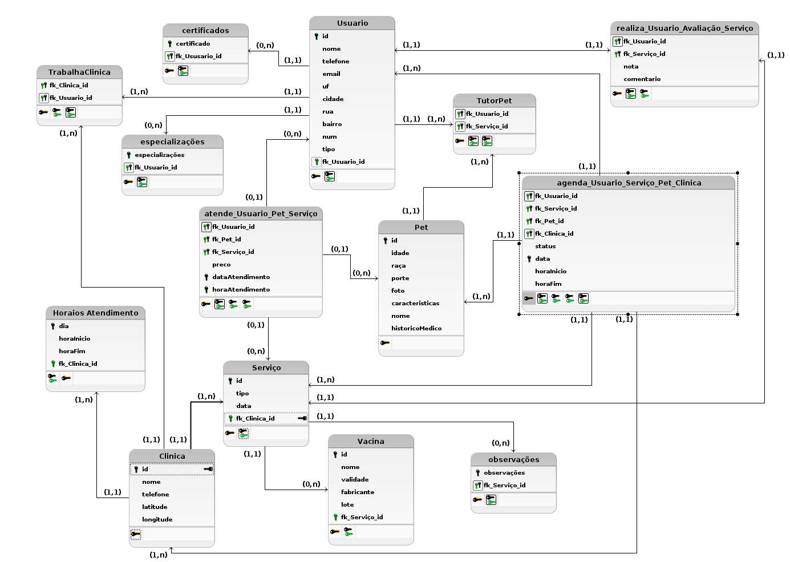

**Usuário** (<u>id</u>, email, nome, telefone, uf, cidade, rua, bairro, num, tipo) \
**Especializações** (<u>idUser</u>, <u>especialização</u>) \
**Certificados** (<u>idUser</u>, <u>certificado</u>) \
**Clinica** (<u>id</u>, nome, telefone, latitude, longitude) \
**ProfissionalTrabalhaClinica** (<u>idClinica</u>, <u>idUser</u>) \
**HorariosAtendimento** (<u>id</u>, dia, horaInicio, horaFim, idClinica) \
**Serviço** (<u>id</u>, tipo, data, idClinica) \
**ObservaçoesServiço** (<u>id</u>, observações, idServiço) \
**Vacina** (<u>id_Serviço</u>, nome, validade, fabricante, lote) \
**Pet** (<u>id</u>, nome, idade, porte, raça,características, foto, historicoMedico, idUser) \
**ProfissionalAtendePetServiço** (<u>idUser</u>, <u>idPet</u>, <u>idServiço</u>, preco, dataAtendimento, horaAtendimento) \
**TutorAgendaServiçoPet** (<u>idUser</u>, <u>idServiço</u>, <u>idPet</u>, <u>idClinica</u>, status, data, horarioInicio, horarioFim) \
**Avaliação** (<u>id</u>, nota, comentario) \
**UsuarioAvaliaServiço** (<u>idUser</u>, <u>idServiço</u>, <u>idAvaliação</u>)