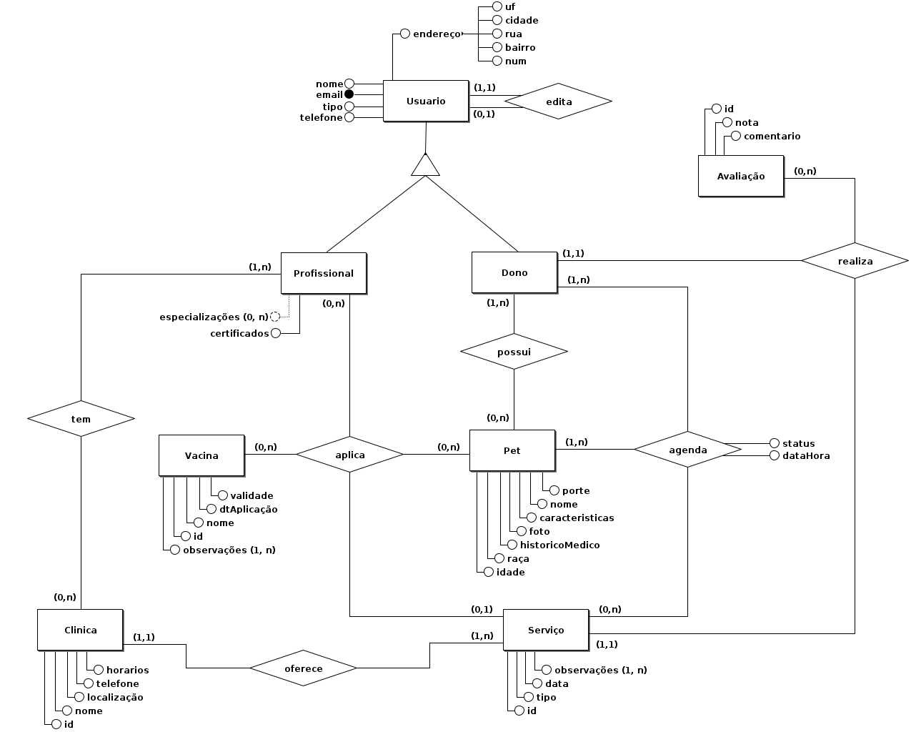

**Avaliação** (id, nota, comentario)
**Serviço** (id, tipo, data, observações, idClinica)
**Clinica** (id, nome, localização, telefone, horarios)
**Vacina** (id, nome, dtAplicação, validade, observações)
**Pet** (nome, porte, características, foto, historicoMedico, raça, idade)
**Usuário** (email, nome, tipo, telefone, uf, cidade, rua, bairro, num)
**Especializações** (idProfissional, especialização)
**Certificados** (idProfissional, certificado)
**TrabalhaClinica** (idProfissional, idClinica)
**DonoPet** (idDono, idPet)
**AvaliaçõesServiço** (idCliente, idServiço, idAvaliação)
**AgendaServiço** (idServiço, idPet, emailCliente)
**RegistroVacinas** (Profissional, idVacina, idPet, idServiço)